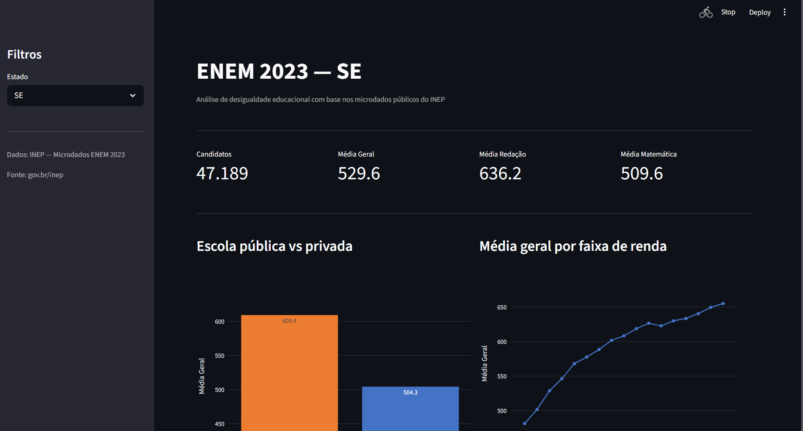
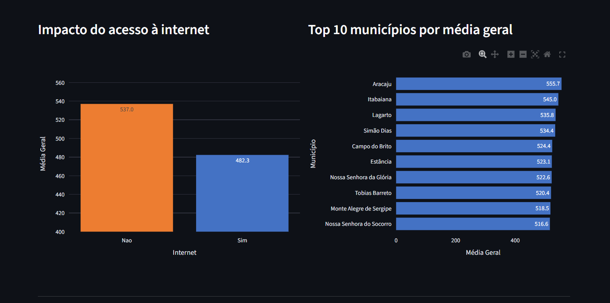
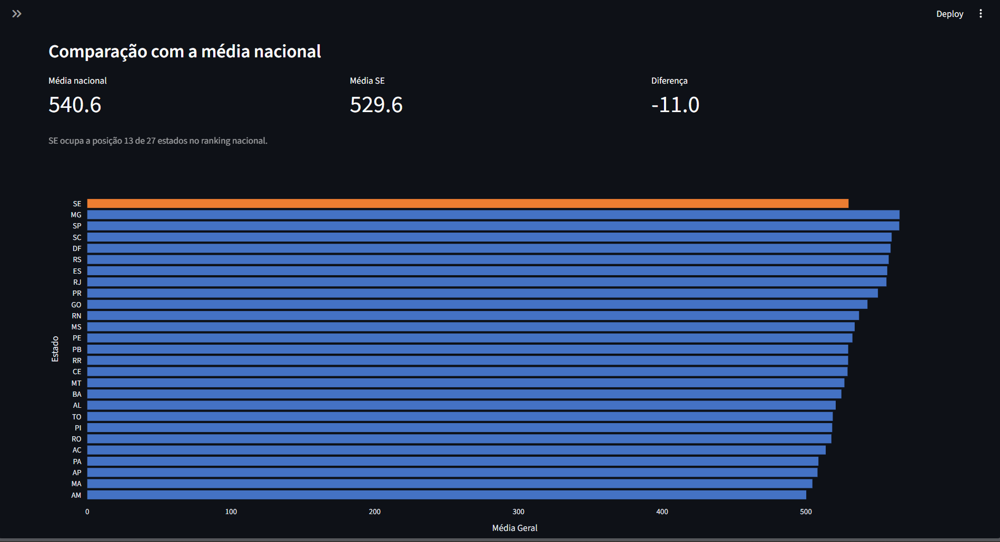

# Pipeline ENEM 2023 — Microdados INEP

Python | Pandas | Parquet | AWS S3 | AWS Glue | Streamlit

---

## Sobre

Pipeline ETL modular para processamento dos microdados do ENEM 2023 — 3,9 milhões
de registros, arquivo bruto de 2 GB+. Lê o CSV do INEP, trata encoding e variáveis
codificadas, carrega o resultado particionado no AWS S3 com catálogo no AWS Glue,
e disponibiliza os dados em um dashboard interativo com Streamlit.

---

## Dashboard







---

## Arquitetura

```
MICRODADOS_ENEM_2023.csv (2GB+)
        |
        v
  pipeline/extrair.py      — leitura em chunks de 100k linhas
        |
        v
  pipeline/transformar.py  — filtro, decodificação, renomeação
        |
        v
  pipeline/carregar_aws.py — upload S3 + catálogo Glue
        |
        v
s3://seu-bucket/processado/
  particionado por uf=SP/, uf=RJ/, uf=SE/ ...
        |
        v
  dashboard.py (Streamlit) — lê do S3, filtra por estado
```

---

## Estrutura do projeto

```
enem-pipeline/
├── main.py                  # orquestrador — ponto de entrada
├── dashboard.py             # dashboard Streamlit
├── pipeline/
│   ├── __init__.py
│   ├── extrair.py           # leitura do CSV bruto em chunks
│   ├── transformar.py       # tratamento e enriquecimento
│   └── carregar_aws.py      # carga no AWS S3 + Glue Catalog
├── screenshots/             # prints do dashboard
├── requirements.txt
├── .gitignore
└── README.md
```

---

## O que cada módulo faz

**extrair.py** — lê o CSV bruto em chunks de 100 mil linhas para não estourar
a memória RAM. O arquivo usa encoding latin-1 e separador ponto e vírgula,
padrão comum em sistemas legados do governo brasileiro.

**transformar.py** — filtra candidatos presentes em todas as provas, remove
registros sem nota, calcula a média geral das cinco áreas, decodifica as
variáveis socioeconômicas (renda, tipo de escola, acesso à internet) e
renomeia as colunas para nomes legíveis.

**carregar_aws.py** — envia o dataset tratado para o S3 em formato Parquet
particionado por UF, e registra a tabela no AWS Glue Catalog. O database
é criado automaticamente se não existir. O particionamento permite consultas
no Amazon Athena lendo apenas o estado necessário.

**dashboard.py** — dashboard Streamlit conectado ao S3. Lê apenas a partição
do estado selecionado, sem baixar o dataset completo. Visões: escola pública
vs privada, média por faixa de renda, impacto do acesso à internet, top 10
municípios e ranking nacional dos 27 estados.

---

## Variáveis do dataset

| Coluna | Descrição |
|--------|-----------|
| `ano` | Ano do exame |
| `municipio` | Município onde a prova foi aplicada |
| `uf` | Estado (partição no S3) |
| `nota_ciencias_natureza` | Nota em Ciências da Natureza |
| `nota_ciencias_humanas` | Nota em Ciências Humanas |
| `nota_linguagens` | Nota em Linguagens e Códigos |
| `nota_matematica` | Nota em Matemática |
| `nota_redacao` | Nota da Redação |
| `media_geral` | Média das cinco áreas |
| `faixa_renda` | Renda familiar decodificada |
| `faixa_renda_ordem` | Índice numérico da faixa para ordenação |
| `tipo_escola` | Pública ou Privada |
| `internet` | Acesso à internet em casa (Sim/Não) |
| `escolaridade_pai` | Escolaridade do pai (código INEP) |
| `escolaridade_mae` | Escolaridade da mãe (código INEP) |

---

## Pré-requisitos AWS

Antes de executar, crie os recursos na sua conta AWS na região de sua preferência:

- Bucket S3 com o nome que preferir
- Credenciais configuradas via `aws configure` com permissões de S3 e Glue

Depois atualize as variáveis no início do `pipeline/carregar_aws.py`:

```python
NOME_BUCKET   = "seu-bucket-aqui"
CAMINHO_S3    = f"s3://{NOME_BUCKET}/processado/"
NOME_DATABASE = "enem_db"
NOME_TABELA   = "microdados_2023"
```

O database no Glue é criado automaticamente pelo pipeline se não existir.

---

## Como executar

```bash
pip install -r requirements.txt
aws configure
python main.py
streamlit run dashboard.py
```

O pipeline leva entre 5 e 15 minutos dependendo da máquina.

---

## Fonte dos dados

INEP — Instituto Nacional de Estudos e Pesquisas Educacionais Anísio Teixeira

Microdados do ENEM 2023 — acesso público via Lei de Acesso à Informação

https://www.gov.br/inep/pt-br/acesso-a-informacao/dados-abertos/microdados/enem